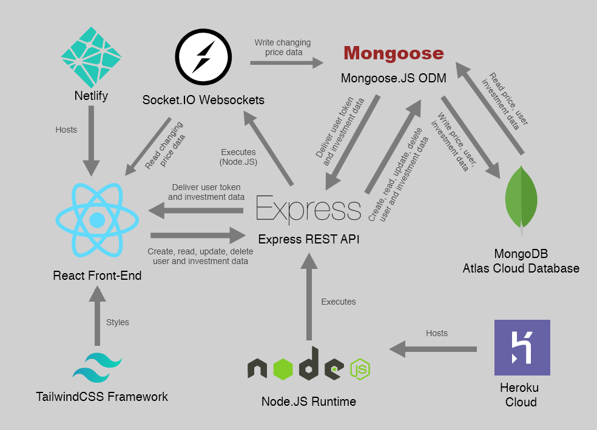
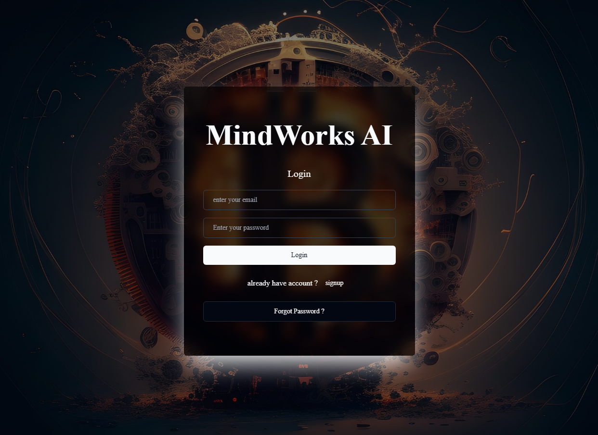

# MindWorks AI

## Overview

MindWorks AI is a crypto trading and investment platform built with the [MERN](https://www.mongodb.com/mern-stack) stack and utilizing [Socket.IO](https://socket.io/) for real time price updates. 


## System Architecture

Big picture view of the application at a glance.




## Tech

This project utilizes the [MERN](https://www.mongodb.com/mern-stack) stack for Back-End and [Socket.IO](https://socket.io/) library. For authentication, a [JWT](https://jwt.io/) solution was implemented.

**Front-End**

- [React](https://reactjs.org/)
- [Redux](https://redux.js.org/)
- [TailwindCSS](https://tailwindcss.com/)
- [Chart.JS](https://www.chartjs.org/)

**Back-End**

- [Node.JS](https://nodejs.org/en/)
- [Express.JS](https://expressjs.com/)
- [Mongoose.JS](https://mongoosejs.com/)
- [Socket.IO](https://socket.io/)

**Database**

- [MongoDB Atlas](https://www.mongodb.com/cloud/atlas)

**Authentication**

- [JSON Web Tokens](https://jwt.io/)


## Developing
To run this application locally, you will need the following prerequisite programs:

- [Node.JS and NPM](https://nodejs.org/en/)
- [Create React App](https://github.com/facebook/create-react-app)
- [MongoDB](https://www.mongodb.com/)


**Front-End Setup**

You’ll need to have Node 20.11.13 or later version on your local development machine (but it’s not required on the server). 

First, install the necessary packages via:

```
npm install
```

Now you can spin up the frontend. Default port is `3000` for a [React] project.

```bash
# start app
npm run dev
```

Open your browser and visit http://localhost:3000/ to access the app

**Back-End Setup**

First, install the necessary packages via:

```
npm install
```

Now you can spin up the backend. Default port is `8000`. 

```bash
# start server
npm run dev
```

## Usage

1. Create an account using /login page
2. Become an admin by putting 500 in Nickname field


